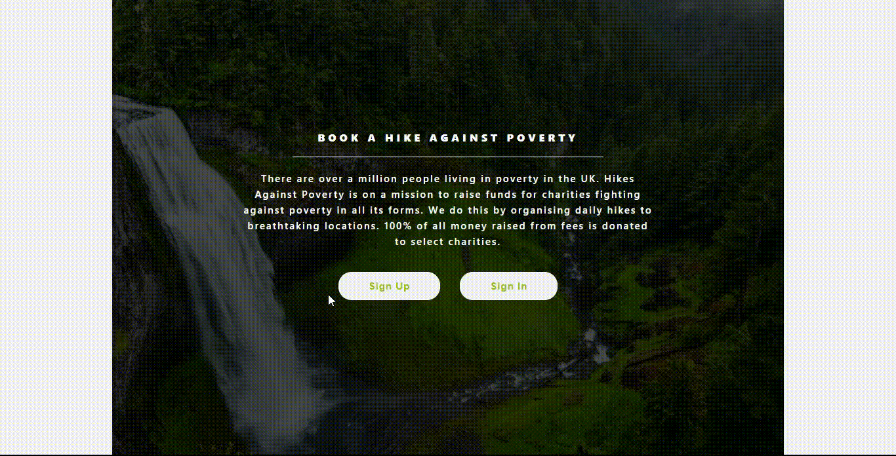

[](https://app.netlify.com/sites/h-a-p/deploys)
[](https://lbesson.mit-license.org/)
[](http://makeapullrequest.com)
[](https://github.com/ellerbrock/open-source-badges/)


# Hikes Against Poverty (HAP)

> There are over a million people living in poverty in the UK. HAP is on a mission to raise funds for charities fighting against poverty, through daily hike events. HAP is built on top of the [HAP API](https://github.com/cliftondavies/HAP-API).



## :tv: Media

[Live Demo Link](https://h-a-p.netlify.app/)

## MVP Features

This MVP allows a user to:

- Before Authentication:
  - View the Home page
  - Sign Up with a valid name, email and password
  - Sign In with a valid email and password
- After Authentication:
  - View a list of all hikes available on the Hikes page
  - View a list of their bookings on the Bookings page
  - View details about a particular hike on the Hike page
  - Book an event for a specific hike, with a valid date and location
  - Sign Out

## :toolbox: Tools & Technologies Used

### Built with

- HTML5
- CSS3
- SCSS
- JavaScript ES6
- React 17.0.2
- Redux >4.0.5

## :rocket: Getting Started

To get a local copy up and running follow these simple example steps.

### Prerequisites

Install [npm](https://www.npmjs.com/get-npm) or [Yarn](https://yarnpkg.com/cli/install)

Install [Node.js](https://nodejs.org/en/download/)

### Set up

Clone repo into your local environment:

Clone with SSH

```git
git clone git@github.com:cliftondavies/Hikes-Against-Poverty.git
```

Clone with HTTPS

```git
git clone https://github.com/cliftondavies/Hikes-Against-Poverty.git
```

Open project directory

```bash
cd [your-directory-name]
```

Install packages:

```javascript
npm install
```

### Local Usage

#### In console

```javascript
npm start
```

#### In Browser

Visit `http://localhost:3000/`.

## Author

👤 **Clifton Davies**

- Github: [@githubhandle](https://github.com/cliftondavies)
- Twitter: [@twitterhandle](https://twitter.com/cliftonaedavies)
- Linkedin: [linkedin](https://www.linkedin.com/in/clifton-davies-mbcs/)

## 🤝 Contributing

Contributions, issues and feature requests are welcome!

## Show your support

Give a ⭐️ if you like this project!

## Acknowledgements

- [create-react-app](https://github.com/facebook/create-react-app)
- [Design inspiration](https://www.behance.net/gallery/26425031/Vespa-Responsive-Redesign)
- [Photos](https://picsum.photos/)
- [Icons](https://iconmonstr.com/)
- [Colors](https://chrome.google.com/webstore/detail/colorpick-eyedropper/ohcpnigalekghcmgcdcenkpelffpdolg?hl=en)

## 📝 Copyright & License

Copyright (c) 2021 Clifton Davies. This project is licensed under [MIT](https://opensource.org/licenses/MIT). See LICENSE file for details.
